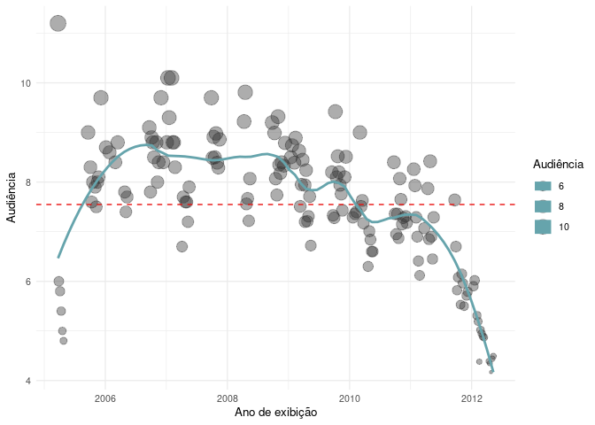

<!-- README.md is generated from README.Rmd. Please edit that file -->

# Projeto final do curso de Web Scraping

</a>
<!-- badges: start --> <!-- badges: end -->

Esse pacote foi produzido especialmente para o trabalho final do curso
de Web Scraping. [curso-r](https://curso-r.com/).

## Instalação

``` r
# install.packages("devtools")
devtools::install_github("katerine-dev/scraperTheoffice")
```

## Descrição

O objetivo do trabalho era scrapear alguma página que resultaria em uma
base de dados. Foi escolhida a página do Wikipédia que contém a lista
completa dos episódios de totas as temporadas da série [The
Office](https://pt.wikipedia.org/wiki/Lista_de_epis%C3%B3dios_de_The_Office_(Estados_Unidos)).

Para manter a consistência da atividade foi escolhido não utilizar a API
documentada do Wikipédia.

## Passos

-   1º Passo: Utilizando a ferramenta inspeccionar foi identificado que
    os dados eram constituídos em formato de `/table`.
-   2° Passo: Scrapear e parsear os dados.
-   3º Passo: Limpeza da base de dados.
-   4º Passo: Foi disponibilizada a base tidy no pacote.

## Base Tidy

``` r
scraperTheoffice::baseTheoffice |> 
  dplyr::glimpse()
#> Rows: 163
#> Columns: 9
#> $ temporada         <chr> "1ª temporada", "1ª temporada", "1ª temporada", "1ª …
#> $ n_total           <dbl> 1, 2, 3, 4, 5, 6, 7, 8, 9, 10, 11, 12, 13, 14, 15, 1…
#> $ n_episodio        <dbl> 1, 2, 3, 4, 5, 6, 1, 2, 3, 4, 5, 6, 7, 8, 9, 10, 11,…
#> $ titulo            <chr> "\"Pilot\"", "\"Diversity Day\"", "\"Health Care\"",…
#> $ dirigido_por      <chr> "Ken Kwapis", "Ken Kwapis", "Ken Whittingham", "Brya…
#> $ escrito_por       <chr> "Ricky Gervais, Stephen Merchant & Greg Daniels", "B…
#> $ audiencia         <dbl> 11.2, 6.0, 5.8, 5.4, 5.0, 4.8, 9.0, NA, 8.3, 7.6, 8.…
#> $ codigo            <chr> "100", "101", "105", "103", "104", "102", "203", "20…
#> $ exibicao_original <date> 2005-03-24, 2005-03-29, 2005-04-05, 2005-04-12, 200…
```

Em resultado do scraper obtive uma base com 163 linhas e 9 variaveis: (a
base foi devidamente documentada: `R/utils-data`)

| Coluna              | Descrição                                                          |
|---------------------|--------------------------------------------------------------------|
| `temporada`         | Temporada do episódio correspondente.                              |
| `n_total`           | Número do episódio correspondente ao total de todas as temporadas. |
| `n_episodio`        | Número do episódio correspondente a temporada.                     |
| `titulo`            | Nome do episódio.                                                  |
| `dirigido_por`      | Diretor do episódio.                                               |
| `escrito_por`       | Escritor do roteiro do episódio.                                   |
| `audiencia`         | Número da audiência na data de exibicao original.                  |
| `codigo`            | Código referente ao episódio.                                      |
| `exibicao_original` | A data da exibicão original do episodio.                           |

## Análise descritiva e resultados

#### Os episódios com mais audiência:

| Temporada    | Título do episódio   | Diretor           | Audiência |
|:-------------|:---------------------|:------------------|----------:|
| 1ª temporada | “Pilot”              | Ken Kwapis        |     11.20 |
| 3ª temporada | “Traveling Salesmen” | Greg Daniels      |     10.10 |
| 3ª temporada | “Ben Franklin”       | Randall Einhorn   |     10.10 |
| 4ª temporada | “Chair Model”        | Jeffrey Blitz     |      9.81 |
| 2ª temporada | “Christmas Party”    | Charles McDougall |      9.70 |
| 3ª temporada | “The Convict”        | Jeffrey Blitz     |      9.70 |
| 4ª temporada | “Fun Run”            | Greg Daniels      |      9.70 |
| 6ª temporada | “Niagara”            | Paul Feig         |      9.42 |
| 5ª temporada | “Employee Transfer”  | David Rogers      |      9.32 |
| 3ª temporada | “The Return”         | Greg Daniels      |      9.30 |

#### Audiência em relação aos anos de exibição:



A séria foi ao ar pela primeira vez a 16 anos, ultrapassando diversas
sérias da época como a série mais assistida dos Estados Unidos, mas
apesar do enorme sucesso no seu tempo de permanência na TV a partir do
ano de 2010 e após a saída do ator Steve Carrell (Michael Scott) a
audiência foi diminuindo até o ultimo episodio exibido em 2013.

A série foi avaliada pelo [IMDB](https://www.imdb.com/title/tt0386676/)
por **8.9** e após anos continua presente entre os memes diários de um
cotidiano de um escritório.

</a>
